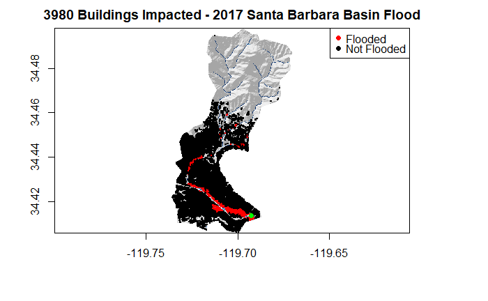

***
```{r setup, include=FALSE}
knitr::opts_chunk$set(warning = F, message = F)
```

```{r bro, echo=FALSE, out.width="50%",out.height="40%",fig.cap="   ",fig.align='left'}

```


## In this lab:

##### - Finding and bringing data into R using Web APIs

##### - Aligning retrieved object and field data

##### - Preparing terrain data for analysis

##### - Building a partial Flood Inundation Map Library for the Mission Creek Basin


***

### Libraries


##### data wrangling tools

- library(tidyverse)


##### raster tools

library(raster) 
library(fasterize)


##### spatial and terrian tools

- library(whitebox)
- library(sf)


##### data used

- library(osmdata)
- library(elevatr)
- library(gifski)


```{r libraries, include=FALSE}
library(sf)
library(raster)
library(fasterize)
library(whitebox)
library(tidyverse)
library(osmdata)
library(elevatr)
library(gifski)

```

***
### Collect Data

#### Create Basin boundary
```{r part1}


basindata <- sf::read_sf("https://labs.waterdata.usgs.gov/api/nldi/linked-data/nwissite/USGS-11119750/basin") 


# convert values from meters to feet (1m = 3.281 feet)
convertmtoft <- function(meters){
  return (meters * 3.281)
}

# crop/mask the elevation data to basin boundary
elevation <- get_elev_raster(basindata, z = 13) %>% 
              crop(basindata) %>% 
              mask(basindata) %>% 
              convertmtoft()

# write raster data folder as a tif file
writeRaster(elevation, "data/elevation_basin.tif", overwrite = TRUE)

```
***

#### Get elevation, buildings and river-network data 

```{r part2}

elevationraster <- raster("data/elevation_basin.tif")

basinbox <- st_bbox(elevationraster) %>% 
            st_as_sfc() %>% 
            st_transform(4326)


buildings <- opq(basinbox) %>% 
            add_osm_feature(key = 'building') %>%
            osmdata_sf()

pointbuildings <- buildings$osm_points %>% 
                    st_intersection(basindata)

buildings <- buildings$osm_polygons %>% 
              st_intersection(basindata) 


# extract the railway POINT from the buildings for latter plotting
railwaypoints <- opq(basinbox) %>% 
                 add_osm_feature(key = 'railway', value = 'station' ) %>%
                 osmdata_sf()

railwaypoints <- railwaypoints$osm_points %>% 
                  st_intersection(basindata) 


streams <- opq(basinbox) %>%
           add_osm_feature(key = 'waterway', value = 'stream') %>%
           osmdata_sf()


streams <- streams$osm_lines %>% 
           st_intersection(basindata) 

```
***
### Terrain Analysis

#### Create Hillshade

```{r part3}

# a “Hillshade” raster for visualization
wbt_hillshade("data/elevation_basin.tif", 'data/basin_hillshade.tif')

basinhillshade <- raster('data/basin_hillshade.tif')

plot(basinhillshade, col = gray.colors(256, alpha = .5), box = F, main = '', legend = F) 
plot(streams, add = T , col = 'blue')
plot(basindata, add = T)

```
***

#### Create Height Above Nearest Drainage (HAND) raster

```{r part 4}


# buffer streamlines using a distance of 10 meters
buffer_streamlines <- streams %>% 
                      st_transform(5070) %>% 
                      st_buffer(10) %>% 
                      st_transform(4326)

# use fasterize to create  river network raster using the elevation grid as the template
rasterrivers <- fasterize::fasterize(buffer_streamlines,  elevationraster)

# write river raster to  data folder
writeRaster(rasterrivers, "data/riverraster.tif", overwrite = T)

riverraster <- raster('data/riverraster.tif')

```

***

#### Creating a hydrologically corrected surface

```{r part5}

# use the whitebox tool wbt_breach_depressions to correct errors in our DEM/elevation grid. 
wbt_breach_depressions("data/elevation_basin.tif", 'data/breachelevationraster.tif')

```
```{r part6}

#
wbt_elevation_above_stream('data/breachelevationraster.tif', "data/riverraster.tif", "data/HANDelevationraster.tif" )

# a “Height Above Nearest Drainage” (HAND) raster for rapid flood assessment
HANDraster <- raster('data/HANDelevationraster.tif')


```

#### Add 3.69 foot offset to current HAND raster and then ensure river network still has a HAND value of 0. 

```{r part 7}

# Add the offset to the entire HAND raster

offsetHANDraster <- HANDraster + 3.69
 
# if the cell has a value of 1 in  river raster then its HAND value is set to 0.
index <- which(values(riverraster) == 1)
values(offsetHANDraster)[index] <- 0 

# save the new, offset raster to your data folder
writeRaster(offsetHANDraster, 'data/offsetHANDraster.tif', overwrite = T)
```

***
### 2017 Impact Assessment

#### Map the flood
```{r part 8}

# Read in the corrected HAND raster
offsetHANDraster <- raster('data/offsetHANDraster.tif')


# Create a flood map where any cell with a HAND value greater then 10.02 is set to NA.
values(offsetHANDraster)[which(values(offsetHANDraster) > 10.02)] <- NA

plot(basinhillshade, col = gray.colors(256, alpha = .5), box = F,
     main = '', legend = F)
# Overlay the flood map using the rev(blues9) color palette and add = TRUE
plot(riverraster,  add = T, col = rev(blues9), box = F, legend = F)
# Plot the railway station as a point of reference colored in green, with cex = 1, and pch = 16
plot(railwaypoints, add = T, col = 'green', box = F, cex = 1, pch = 16)


```
***
#### Estimate and visualize the impacts

```{r part 9}
# use the OSM building centroids to extract the flood depth at each structure from your flood raster
flooddepth <- raster::extract(offsetHANDraster, pointbuildings)
# count the number not equal to NA in order to determine the number of impacted structures.
pointbuildings$flooded <- as.factor(ifelse(!is.na(flooddepth), 1, 0))

plot(basinhillshade, col = gray.colors(256, alpha = .5), box = F, main = paste(sum(pointbuildings$flooded==1),
                                                      'Buildings Impacted - 2017 Santa Barbara Basin Flood'),
                                                      legend = F)
# add flood map
plot(offsetHANDraster,add = T,  col = rev(blues9), box = F,  legend = F)
# add the buildings centroids to the map:
plot(pointbuildings, add = T, col = c('black','red')[pointbuildings$flooded], box = F, cex = .08, pch = 16)
# Add the railroad as a reference point
plot(railwaypoints, add = T, col = 'green', box = F, cex = 1, pch = 16)
legend(x = 'topright', legend = c('Flooded', 'Not Flooded'), 
       col = c('red', 'black'), cex = 1, pch = 16)

```
